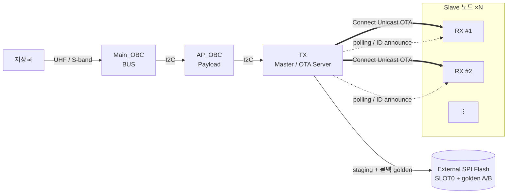
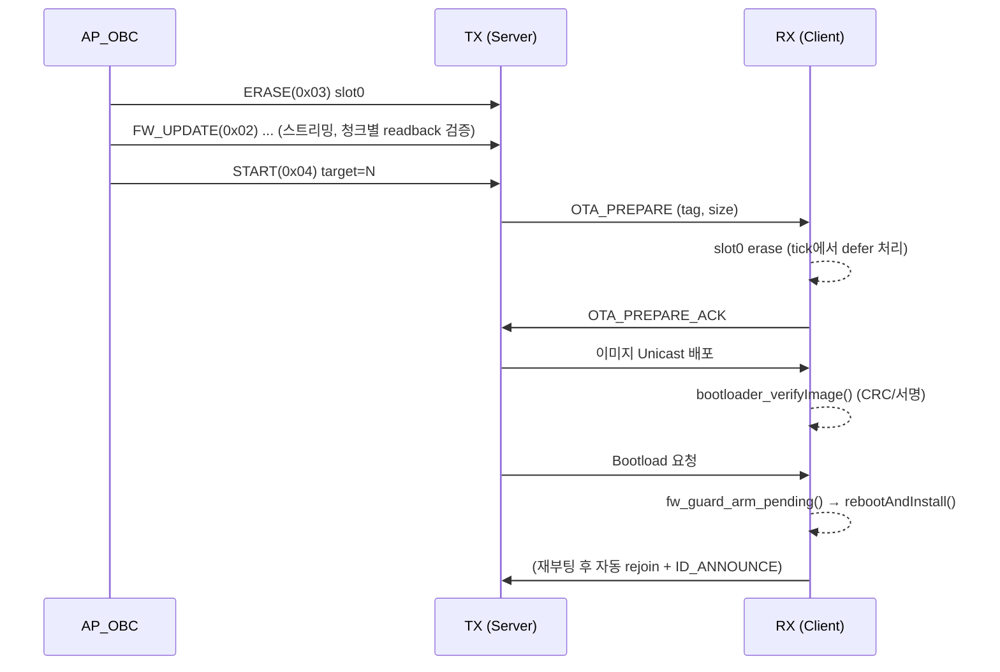

# ACL — 큐브위성 무선(OTA) 펌웨어 업데이트 시스템

EFR32FG12P(Silicon Labs) 기반 큐브위성 노드의 **자동화 OTA 펌웨어 업데이트** 시스템입니다. 지상국에서 AP_OBC를 거쳐 전달된 펌웨어 이미지를, Master 노드가 Connect 무선 스택을 통해 다수의 Slave 노드에 배포·설치하며, 모든 단계에 **검증 후 설치(verify-before-install)** 와 **자동 롤백 가드**를 적용해 잘못된 이미지로 인한 brick(영구 동작불능)을 차단합니다.

> **핵심 결론**
> J-Link·UART 접근이 불가능한 궤도상 위성에서는 한 번의 잘못된 OTA가 곧 노드의 영구 손실로 이어집니다. 본 시스템은 ① 스트리밍 중 청크별 readback 검증, ② 설치 직전 `bootloader_verifyImage()` CRC/서명 검증, ③ 부팅 후 헬스 확인에 실패하면 외부 SPI 플래시에 보관된 golden 이미지로 자동 복구하는 **3중 방어**로 이 위험을 제거합니다.

---

## 1. 시스템 구성

| 노드 | 역할 | Connect 역할 | 비고 |
|------|------|-------------|------|
| **TX** (`cubesat_TX`) | Master / OTA **Server** | Sink · Coordinator | AP_OBC와 I2C 연결, 이미지 staging 및 배포 주체 |
| **RX** (`cubesat_RX`) | Slave / OTA **Client** | Sensor · End Device | 센서 노드, OTA 수신·자가 설치 |
| **Bootloader** (`bootloader-storage-spiflash-sfdp-single`) | Gecko Bootloader | — | 외부 SPI 플래시(SFDP) 단일 슬롯 스토리지 |

* **무선 스택**: Silicon Labs Connect (sub-GHz, 채널 0~10 ≈ 902–922 MHz)
* **커스텀 엔드포인트**: `0x02`

### 통신 체인

```
지상국 ──UHF/S-band──▶ Main_OBC(BUS) ──I2C──▶ AP_OBC(Payload) ──I2C──▶ TX(Master/Sink) ──Connect RF──▶ RX(Slave/Sensor) ×N
                                                                              │
                                                                              └─ 외부 SPI Flash (SLOT0 staging + golden A/B)
```



---

## 2. 디렉토리 구조 (주요 코드)

```
ACL_IWSB/
├── cubesat_TX/                          # Master (OTA Server, Coordinator)
│   ├── app_init.c / .h                  #  bootloader_init → fw_guard_init → 스택 초기화
│   ├── app_process.c / .h               #  I2C 명령 처리, OTA 상태머신, 폴링, slave 테이블
│   └── fw_guard.c / .h                  #  롤백 가드 (golden 캡처는 pending_commit 시에만)
│
├── cubesat_RX/                          # Slave (OTA Client, End Device)
│   ├── app_init.c / .h                  #  bootloader_init → fw_guard_init → 첫 join 위임
│   ├── app_process.c / .h               #  OTA 수신, 자가 설치, 재join 자가복구
│   └── fw_guard.c / .h                  #  롤백 가드 (SLOT0가 항상 자기 이미지 → 부트스트랩 캡처 허용)
│
└── bootloader-storage-spiflash-sfdp-single/   # Gecko Bootloader (외부 SPI Flash, 단일 슬롯)
```

---

## 3. OTA 동작 흐름

### 3.1 I2C 명령 (AP_OBC → TX)

| 명령 | 코드 | 페이로드 | 설명 |
|------|------|----------|------|
| `OBC_CMD_DATA` | `0x01` | `[cc]` | 상태/데이터 요청 |
| `OBC_CMD_FW_UPDATE` | `0x02` | `[cc][packet_num:2 LE][len:1][data:N]` | GBL 이미지 스트리밍 |
| `OBC_CMD_ERASE` | `0x03` | `[cc][slot]` | 스토리지 슬롯 erase (스트리밍 전 필수) |
| `OBC_CMD_START` | `0x04` | `[cc][target]` | OTA 트리거 (`target=0`: TX 자체, `1~4`: RX device_id) |

스트리밍의 마지막 패킷은 `packet_num = 0xFFFF` 센티넬로 표시되며, 오프셋은 누적값으로 추적합니다.

### 3.2 RF 메시지 타입 (TX ↔ RX)

| 메시지 | 코드 | 방향 |
|--------|------|------|
| `MSG_TYPE_OTA_PREPARE` | `0xF0` | TX → RX (배포 준비 요청) |
| `MSG_TYPE_OTA_PREPARE_ACK` | `0xF1` | RX → TX (슬롯 erase 완료 ACK) |
| `MSG_TYPE_ID_ANNOUNCE` | `0xA0` | RX → TX (device_id + EUI-64 알림) |
| `MSG_TYPE_POLL_REQUEST` | `0xB0` | TX → RX (생존/버전 폴링) |
| `MSG_TYPE_POLL_RESPONSE` | `0xB1` | RX → TX (device_id + fw_version) |

### 3.3 RX OTA 시퀀스 (`target = 1~4`)



TX 자체 업데이트(`target = 0`)는 `verifyImage → setImageToBootload → fw_guard_arm_pending → rebootAndInstall` 순으로 진행되며, **이 노드가 망가지면 모든 RX로 가는 OTA 경로가 끊겨 전 네트워크가 마비** 되므로 롤백 가드가 특히 중요하게 동작합니다.

---

## 4. 안전(Safe-OTA) 메커니즘

본 프로젝트의 핵심은 "**잘못된 업데이트가 노드를 죽이지 않는 것**"입니다. 다음 세 계층으로 방어합니다.

### 4.1 수신 단계 — 무결성 검증
* **청크별 readback**: `bootloader_writeStorage()` 직후 같은 영역을 다시 읽어 `memcmp`로 비교, 플래시 손상을 즉시 검출.
* **슬롯 경계 검사**: 누적 오프셋이 `storage_slot_size`를 초과하면 `OTA_ERROR`로 중단(오버플로 방지).
* **드롭 패킷 진단**: 시퀀스 점프를 로그로 남기고, 최종적으로 CRC 불일치 이미지는 설치 단계에서 걸러냄.

### 4.2 설치 단계 — 검증 후 설치
* `bootloader_verifyImage(0, NULL)`이 **성공한 경우에만** `setImageToBootload(0)` 및 `rebootAndInstall()`을 호출.
* 검증 실패 시 현재 펌웨어를 유지하고 재시도 가능 상태로 복귀.

### 4.3 부팅 단계 — 자동 롤백 가드 (`fw_guard`)

| 상태 | 동작 |
|------|------|
| 설치 직전 | `fw_guard_arm_pending()` → `pending_commit=1`, `boot_attempts=0` (다음 부팅이 probation) |
| probation 부팅 | `fw_guard_init()`에서 `boot_attempts++` |
| 헬스 확인 성공 | 스택/네트워크가 **15초 연속 안정** → `fw_guard_confirm_healthy()`로 SLOT0를 golden에 캡처 |
| 헬스 확인 실패 | `BOOT_HEALTH_TIMEOUT`(180초) 내 미확정 시 self-reset, 누적 |
| 임계 도달 | `boot_attempts ≥ 5` → 외부 SPI 플래시의 golden 이미지로 자동 롤백 설치 |

golden 보관은 **A/B 핑퐁 + readback 검증 + NVM3 원자적 플립**으로 전원 차단에도 안전하며, 기하구조(`validate_geometry`) 검증에 실패하면 롤백을 자동 비활성화하는 fail-safe 설계입니다.

> **TX 전용 주의**: TX의 SLOT0는 자체 펌웨어 staging과 RX 펌웨어 staging을 **공유**합니다. 따라서 TX는 `FW_GUARD_CAPTURE_ON_BOOTSTRAP=0`으로 두어 **TX 자체 OTA 직후(`pending_commit`)에만** golden을 캡처합니다. (RX 이미지가 TX golden으로 박제되어 코디네이터가 brick 되는 것을 방지)

### 4.4 무선 링크 자가복구
* **재Join 지수 백오프** (2s → 20s 상한), **resume 워치독**(15s 정체 시 강제 재join).
* **stale coordinator 복구**: RX가 NodeID `0x0000`으로 잘못 resume되면 NVM3 네트워크 상태를 비우고 재부팅(무접근 deadlock 방지).
* **장시간 미가입**(5분) 시 칩 self-reset, **하트비트 타이머**로 EM2 sleep 중에도 tick 보장.

---

## 5. 부트로더 구성

`bootloader-storage-spiflash-sfdp-single`는 Gecko Bootloader 샘플을 기반으로 외부 SPI 플래시(SFDP 자동 인식)에 단일 슬롯 스토리지를 구성합니다.

| 설정 | 값 |
|------|-----|
| 컴포넌트 | `bootloader_common_storage_single`, `bootloader_spiflash_storage_sfdp` |
| `BTL_STORAGE_BASE_ADDRESS` | `0` |
| `SLOT0_START` | `0` |
| `SLOT0_SIZE` | `524288` (512 kB) |

golden 영역(`fw_guard`)은 SLOT0(`0x84000`~)과 겹치지 않는 상위 주소(`0x180000`/`0x1C0000`, 각 256 kB)에 배치됩니다.

---

## 6. 최초 설정 (Getting Started) — 처음 받는 사람용

> **결론**: 본 레포의 `cubesat_TX` / `cubesat_RX`는 Connect 기본 예제(**SoC Sink / SoC Sensor**)에 OTA·부트로더·NVM3 컴포넌트를 추가하고, 그 위에 본 레포의 소스 파일을 덮어쓴 프로젝트입니다. 빈 폴더를 빌드하는 게 아니라, **예제로 프로젝트를 생성 → 컴포넌트 추가 → 소스 교체** 순서로 재구성해야 합니다.

### 6.1 사전 준비
1. **Simplicity Studio v5** 설치 후, Preferences → SDKs 에서 **Gecko SDK (Flex SDK 포함)** 설치. Connect 스택은 Flex SDK에 포함되어 있고 RAIL 위에서 동작합니다.
2. 대상 보드(EFR32FG12P)를 연결하고 Launcher에서 인식 확인.
3. Simplicity Commander 경로를 PATH에 등록 (`.../SimplicityStudio/v5/developer/adapter_packs/commander`).

### 6.2 베이스 예제 프로젝트 생성
Launcher → EXAMPLE PROJECTS & DEMOS → Technology Type에서 **Connect** 필터 후 생성합니다.

| 본 레포 | 베이스 예제 | 역할 |
|---------|-------------|------|
| `cubesat_TX` | **Connect - SoC Sink** | Coordinator / OTA Server |
| `cubesat_RX` | **Connect - SoC Sensor** | End Device / OTA Client |

각각 Create → 프로젝트 생성 후, `.slcp`의 Software Components 탭에서 아래 컴포넌트를 추가합니다.

### 6.3 추가할 Software Components

**공통 (TX · RX 모두)**
- **Bootloader Application Interface** — `bootloader_interface` (`btl_interface.h`, 슬롯 read/write/verify)
- **NVM3 Default Instance** — device_id / slave_table / fw_guard 상태 영속화
- **Sleep Timer** — OTA 타임아웃·폴링·헬스 타이머
- **Frequency Hopping** — `emberAfFrequencyHopping*` 콜백 사용 시
- **IO Stream: USART** + **Log (app_log)** — VCOM 디버그 로그
- **Watchdog (WDOG, emlib)** — `fw_guard`의 hang 감지·복구

**TX (Sink) 전용**
- **OTA Unicast Bootloader Server** — `ota-unicast-bootloader-server` (이미지 배포 주체)
- **Simple LED** (인스턴스 `led0`) — 스택 up 표시
- **I2C 주변장치** (AP_OBC 인터페이스용) — `app_init.c`의 OBC I2C 수신 구성과 일치시킬 것

**RX (Sensor) 전용**
- **OTA Unicast Bootloader Client** — `ota-unicast-bootloader-client` (이미지 수신·설치)
- **Power Manager** — `sl_power_manager` (미가입 동안 EM2 sleep 차단 로직)

> 컴포넌트 카탈로그의 정확한 경로/명칭은 SDK 버전에 따라 약간 다를 수 있습니다. 검색창에 위 키워드를 입력해 찾으세요. OTA Unicast 플러그인은 기본 엔드포인트 13번을 사용하므로, 본 레포의 커스텀 메시지 엔드포인트(`0x02`)와 충돌하지 않습니다.

### 6.4 소스 파일 교체
컴포넌트 추가 후 **Generate** 하면 `app_init.c` / `app_process.c` 등 골격이 생성됩니다. 이 파일들을 본 레포의 동일 이름 파일로 덮어쓰고, `app_process.h` / `fw_guard.c` / `fw_guard.h`를 프로젝트에 추가합니다.

```
cubesat_TX/  →  app_init.c, app_process.c, app_process.h, fw_guard.c, fw_guard.h
cubesat_RX/  →  app_init.c, app_process.c, app_process.h, fw_guard.c, fw_guard.h
```

### 6.5 부트로더 빌드
`bootloader-storage-spiflash-sfdp-single` 프로젝트를 별도로 생성/빌드합니다 (구성값은 §5 참조). 최초 플래싱에는 **`-combined.s37`** 만 사용해야 합니다 — 이 파일만 1단계 부트로더를 포함하기 때문입니다.

---

## 7. OTA 배포 절차

### 7.1 최초 플래싱 (J-Link, 1회만)
지상에서 각 보드에 **부트로더 + 애플리케이션**을 한 번 적재합니다. 이후의 모든 업데이트는 무선(OTA)으로 수행합니다.

```bash
# 1) 부트로더 (combined 필수)
commander flash bootloader-...-combined.s37

# 2) 애플리케이션 (TX는 sink, RX는 sensor)
commander flash cubesat_TX.s37      # TX 보드
commander flash cubesat_RX.s37      # RX 보드 (device_id 1~4 별로 빌드, §8 참조)
```
> `.bin`은 주소 정보가 없어 부트로더를 덮어쓸 수 있으므로 사용하지 마세요. `.s37` 또는 `.hex`를 쓸 것.

### 7.2 GBL 이미지 생성
배포할 새 펌웨어(`.s37`)를 GBL로 변환합니다.
```bash
commander gbl create app.gbl --app app.s37
```
> 압축(`--compress`)이나 서명(`gbl keygen`)은 부트로더에 해당 컴포넌트가 설정돼 있을 때만 사용합니다. 본 프로젝트는 기본 GBL 생성만으로 동작합니다.

### 7.3 무선 배포 (TX / RX 구분)

배포 대상은 `START(0x04)`의 `target` 값으로 결정됩니다. 두 경우 모두 공통으로 **`ERASE(0x03,0) → FW_UPDATE(0x02) 스트리밍 → START(0x04, target)`** I2C 명령을 TX에 보내며, 이후 동작이 아래와 같이 갈립니다.

| 구분 | **TX 자체 업데이트** | **RX 업데이트** |
|------|------------------------|------------------|
| `START` target | `0x00` | `0x01 ~ 0x04` (RX device_id) |
| 업데이트 대상 | TX(코디네이터) 자신 | 지정한 device_id의 RX |
| 무선 전송 | 없음 (TX 로컬 슬롯에서 바로 설치) | Connect **Unicast OTA**로 RX에 전송 |
| 설치 절차 | `verifyImage` → `setImageToBootload` → `fw_guard_arm_pending` → `rebootAndInstall` | TX: `OTA_PREPARE` → ACK 대기 → 이미지 배포 → bootload 요청<br/>RX: `verifyImage` → `fw_guard_arm_pending` → `rebootAndInstall` |
| 검증 위치 | TX | RX (수신 후 자체 검증) |
| 완료 후 동작 | TX 재부팅 → 네트워크 재구성 | RX 재부팅 → 자동 rejoin + `ID_ANNOUNCE` 재등록 |
| 롤백 가드 | **pending_commit 시에만** golden 캡처(SLOT0 공유 주의, §4.3) | RX가 자체 golden 독립 관리 |
| 위험도 | **높음** — 단일 장애점이므로 실패 시 전 네트워크 마비 | 낮음 — 해당 RX만 영향, TX·타 RX 정상 |
| 비고 | 헬스 확인(15초) 끝나기 전 RX OTA 시작 금지 | 같은 이미지를 다른 RX에 즉시 재배포 가능(`FW_READY` 유지) |

> RX 업데이트는 TX가 PREPARE부터 bootload 완료까지 상태머신으로 **자동 진행**되므로, OBC는 `START(0x04, N)` 한 번만 보내면 됩니다. RX가 오프라인이면 TX가 최대 3회 재시도 후 `FW_READY`로 복귀하여 나중에 재시도할 수 있습니다.

### 7.4 검증
- TX VCOM 로그에서 `OTA TX: ...%` 진행률과 `=== OTA DONE ===` 확인.
- 이후 폴링 응답(`MSG_TYPE_POLL_RESPONSE`)의 `fw_version` 값이 새 버전(`FW_VERSION_MAJOR`)으로 바뀌었는지 확인.
- 새 펌웨어가 15초 헬스 윈도우를 통과하지 못하면 `fw_guard`가 golden 이미지로 자동 롤백합니다(§4.3).

---

## 8. Device ID 프로비저닝 (RX)

RX는 다음 우선순위로 자신의 `device_id`(1~4)를 결정합니다.

1. **`MY_DEVICE_ID_FALLBACK`** (`app_process.h`): 1~4로 빌드하면 그 값을 NVM3에 권위적으로 기입. 첫 OTA 시 보드별로 1/2/3/4로 빌드.
2. **`g_eui64_map[]`**: 보드 EUI-64를 알면 매핑 테이블로 단일 빌드 프로비저닝 가능.
3. **NVM3 저장값**: `0xFF`로 빌드하면 각 보드가 NVM3의 자기 값을 사용 → 이후 OTA는 단일 GBL로 4개 보드 동시 업데이트.

> EUI-64 확인: TX에서 `info` CLI, 또는 `commander device info`.

### NVM3 키 맵
| 키 | 노드 | 용도 |
|----|------|------|
| `0x0001` | RX | device_id |
| `0x0002` | TX | slave_table (device_id 배열, 영속화) |
| `0x0003` | TX/RX | fw_guard 상태 |

---

## 9. 운용 모드

| 모드 | 트리거 | 상태 |
|------|--------|------|
| **우주 모드** | AP_OBC의 `START(0x04)` I2C 명령 | `OTA_FW_READY` → 상태머신 자동 진행 |
| **지상 모드** | J-Link 적재 후 BTN0 | `OTA_FW_READY_MANUAL` |

---

## 10. 참고 문서 (공식)

* [UG435.06: Bootloading and OTA with Silicon Labs Connect](https://www.silabs.com/documents/public/user-guides/ug435-06-bootloading-and-ota-with-connect-v3x.pdf)
* [UG489: Silicon Labs Gecko Bootloader User Guide (GSDK 4.0+)](https://www.silabs.com/documents/public/user-guides/ug489-gecko-bootloader-user-guide-gsdk-4.pdf)
* [Connect Stack API Reference — OTA Unicast Bootloader](https://docs.silabs.com/connect-stack/latest/connect-stack-api/ota-unicast-bootloader-server)
* [UG162: Simplicity Commander Reference Guide](https://www.silabs.com/documents/public/user-guides/ug162-simplicity-commander-reference-guide.pdf)
* [AN1135: Using Third Generation Non-Volatile Memory (NVM3)](https://www.silabs.com/documents/public/application-notes/an1135-using-third-generation-nonvolatile-memory.pdf)

---

*Yonsei ACL — IWSB CubeSat OTA Subsystem*
